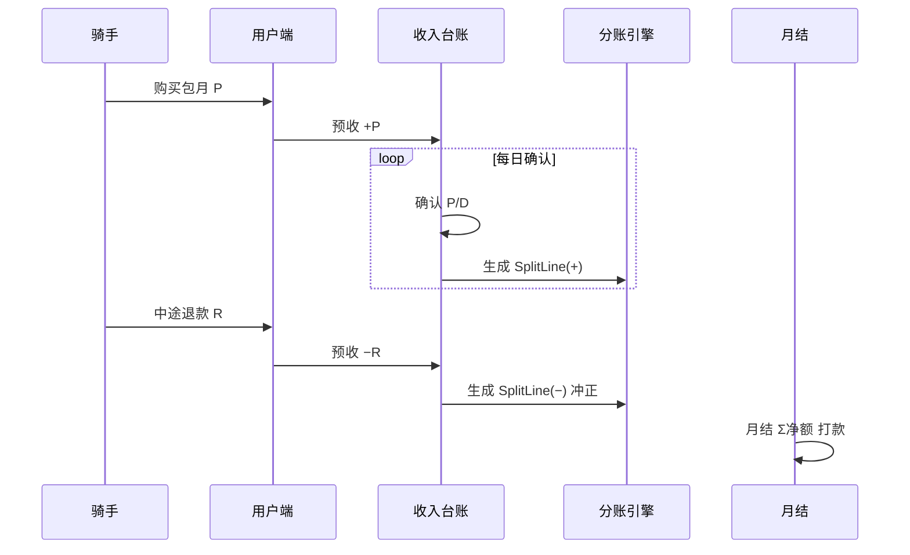

# 合作模式与分账（暂定）

> 业务扩张默认模式：**平台管理员、运营商、渠道商、资金方**四角色后台协作；**运营商可持有自有或租赁设备**（平台不持运营设备）。**智格平台**提供物联网与用户端，收取 **1% 技术服务费**（C 端支付分账 + B 端渠道人天**确认消耗**计提），不从运营流水抽运营分成。渠道 B2B 批发款在**采购到账时**已是运营商收入，骑手消耗人天**不触发向运营商二次打款**。各方按 `device_owner_id` 隔离订单与流水；**合作伙伴场地分润**与运营商自营分账分菜单。

**产品形态**：`原型/外卖` 为**运营商 / 渠道商 / 资金方自用后台**；品牌方总部看板见 `req-prototype` 等其它项目。

**跨运营商清分**：柜机/电池使用费、保证金/信用额度见 **[换电场景与运营商结算.md](./换电场景与运营商结算.md)**。

**合作伙伴场地分润**：见本文 §9 与 **`功能结构与业务流程.md`**。

## 1. 商业分工

| 角色 | 投入 / 产出 |
|------|-------------|
| **运营商** | 可**自有或租赁**柜/电；场地管理、运维、用户服务、渠道批发；架构 B 下为**收款主体** |
| **渠道商** | 向运营商采购人天额度；登记团队骑手；在签约范围内换电 |
| **合作伙伴（场地/联营）** | 不持设备；按合同约定从**关联站点**可分配收入中分成；可登录后台查分润与提现 |
| **我方（品牌方）** | 物联网、用户端、运营平台、支付清分能力、品牌与 SOP；**不抽运营分成** |
| **资金方** | 出租柜/电；管理租赁协议与租金收缴 |
| **已有系统** | 物联网、用户端（向运营商及授权站点开放） |

硬件 CAPEX 在**运营商**（租赁时产权在资金方）；合作伙伴收入来自场地分润，与运营商自营流水**分表、分菜单**。

## 2. 我方服务包（可签约拆分）

| 服务项 | 说明 |
|--------|------|
| 物联网平台 | 设备接入、状态监控、告警、远程运维 |
| 用户端 | 骑手注册、换电、套餐与支付（资金进监管户） |
| 运营平台 / 工具 | 合作方看板、对账、工单、站点与设备管理 |
| 品牌与合规 | 定价框架、VIS、安全与 SLA 标准 |

可选：**按站 SaaS 年费 / 按柜月费 / 按量技术服务费**（与运营分成**分离**，按月或按年向运营商 billing，不进骑手套餐应分池）。

## 3. 分账规则（暂定）

### 3.1 原则

- 骑手套餐/次卡实收进入**持牌监管账户**（**架构 B**：收款主体为**运营商**二级商户号，见 §8）。
- 按订单归因至 **站点 → 运营商（device_owner_id）** 后确认收入。
- **平台 1% 技术服务费**：C 端在支付成功时分账；B 端渠道人天在确认消耗时按**平台标准人天价**向额度售卖方运营商计提（见 [换电场景与运营商结算.md](./换电场景与运营商结算.md)）。
- **可分配经营收入** = 确认收入 − **支付通道手续费** − **平台 1%（C 端已分账部分）**（及合同约定的营销补贴分摊）；余下为运营商净得及合作伙伴场地分润基数。
- **平台 SaaS/技术服务合同**与单笔骑手订单应分台账**分表管理**。

### 3.2 包月套餐：不要「一付就分」

骑手购买的是**包月套餐**（含服务期、可能含换电次数上限），中途可能**全额/部分退款**。若按支付成功立刻分账，会出现：

- 退款后合作方已拿钱，需追回，对账与客诉成本高；
- 骑手未使用天数对应的收入不应分给合作方；
- 跨月套餐、换站换电时，归因站点与分账周期易错乱。

**推荐：按「收入确认」分账，而非按「收款」分账。**

| 时点 | 只记台账 | 参与分账 |
|------|----------|----------|
| 骑手支付包月成功 | 预收账款（监管户余额 +） | 否 |
| 服务期内按规则「确认收入」 | 可分配经营收入 + | 是，记入运营商应分（及合作伙伴场地分润） |
| 中途退款 | 冲减可分配收入 / 预收 | 是，按退款规则负向冲正应分 |
| 月结打款 | — | 只对**已确认且未退款**的净额汇总打款 |

**后台展示（运营商）**：`资金实收` 记骑手支付与退款出款；`应分台账` 记确认收入与应分、冲正；`打款批次` 记周期完结后的商户留存。三者不可混在同一列表。

### 3.3 收入确认（包月，推荐默认）

**按服务期按日摊销**（实现简单、与退款自然对齐）：

```
套餐实收（扣除支付手续费）= P
服务期天数 = D（如 30 天，按自然日或 24×30 小时写进合同）
每日确认收入 = P / D

第 t 日可分配收入 = 每日确认收入（若当日未发生退款终止）
```

可选增强（二期）：**按有效换电次数摊销**——设套餐等价「含 N 次换电」，每成功换电确认 `P/N`，更适合「包月限次」产品；未用完次数在到期时一次性确认或作废，需在用户协议写明。

**归因**：确认收入当日，按**主站点**归属（建议优先级）：

1. 套餐购买时绑定的 `purchase_site_id`（默认）  
2. 或：服务期内**换电次数最多的站点**（按月重算，写入合同二选一）  

取**确认当日**该站点生效的合作伙伴分润合同（若有）。

### 3.4 分账计算公式（净额）

```
某笔确认（某日、某站点）：
  allocatable = 当日确认收入 − 支付手续费分摊 − 营销补贴分摊（若有）

  运营商净得 = allocatable − 合作伙伴应得（若有）
  平台 1%（C 端）已在支付时分账，不在此重复扣减
```

**周期打款批次**：

```
运营商净得 = Σ 应分 − Σ 退款冲正 − Σ 合作伙伴应得
```

仅当净额 > 0 且站点满足有效站/SLA 时进入「可打款」；否则挂「待结算 / 冻结」。

### 3.5 退款设计（中途退款）

#### 3.5.1 退款类型

| 类型 | 典型场景 | 处理 |
|------|----------|------|
| **全额退款** | 开通后 N 天内未换电、重大故障 | 终止服务期；未确认部分不再确认；已确认部分按政策决定是否追回 |
| **部分退款** | 提前解约、协商退剩余天数 | 剩余天数不再确认；已确认收入按规则冲回 |
| **仅退差价** | 套餐降级 | 冲减差额对应的未确认 + 已确认（若需） |

#### 3.5.2 剩余天数法（部分退款，推荐）

```
已服务天数 = d
应退金额 R（支付通道退回骑手，R ≤ 未确认预收余额）

未确认收入冲减 = min(R, P − 已确认累计)
若 R 大于未确认部分，则超出部分从「已确认累计」中按相同比例冲减：
  冲减可分配收入 = R（上限为 P）
  冲减各方应分 = 按原 SplitLine 上运营商/合作伙伴金额比例冲正
```

**全额退款且未产生任何确认**（如 7 天无理由、0 次换电）：`R = P`，不产生分账行，支付手续费损失按合同约定（总部承担或按比例）。

**已月结打款后发生退款**：本期生成**负向调整单** `Adjustment`，在下个结算周期抵扣；不足则记入合作方应付余额为负或保证金扣回。

#### 3.5.3 退款与分账时序（示意）



### 3.6 与「按次换电」的并存

若同时有次卡/超次付费：

| 产品 | 收入确认时点 | 分账 |
|------|--------------|------|
| 包月 | 按日摊销或按次摊销 | 同上 |
| 次卡/超次 | **换电成功当笔**实收 | 当笔确认、当笔分账 |

同一骑手包月期内超次另付费：次卡订单**单独订单号**，不参与包月摊销表。

### 3.7 比例变更

- 以合作伙伴 `SettlementContract` 生效日为准，**新确认的收入**用新分成比例，历史 `SplitLine` 不追溯。
- 退款冲正按**原 SplitLine 各方金额**冲回。

### 3.8 暂不包含（二期）

- 平台 SaaS 账单与运营应分台账的自动对账
- 支付通道实时分账（首期：**内部台账 + 月结代付**）

## 4. 设备与结算前提

- 设备须为**总部认证型号**，经物联网平台入网后方可计费分账。
- 建议 **有效站** 门槛（可选）：月活跃骑手、柜体可用率、客诉闭环达标后，才释放上月分账打款。

## 5. 对账字段（运营看板 / 财务）

| 字段 | 说明 |
|------|------|
| `subscription_id` | 包月主单 |
| `payment_id` | 支付单（实付 P） |
| `service_start` / `service_end` | 服务期 |
| `recognition_date` | 收入确认日（摊销日） |
| `recognized_amount` | 当日确认收入 |
| `partner_id` / `site_id` | 归因 |
| `platform_fee` | C 端 1% 分账（支付成功时） |
| `op_amount` / `partner_amount` | 运营商净得、合作伙伴应分（正/负） |
| `saas_invoice_id` | 可选；平台 SaaS 费与运营台账分表 |
| `refund_id` / `refund_amount` | 退款单 |
| `split_line_type` | `RECOGNIZE` / `REFUND_REVERSAL` |
| `settlement_status` | 待对账 / 已确认 / 已打款 / 冻结 |

## 6. 数值示例

包月 **P = 300 元**，**D = 30 天**，购买站点为「浦东站」，合作伙伴场地分润 10%。支付手续费与 C 端 1% 平台费另计。

| 事件 | 处理 |
|------|------|
| 支付成功 | 预收 300；C 端 1% 分账至平台；不生成运营商打款 |
| 第 1–10 日正常服务 | 每日确认 10 元；合作伙伴 1 元/日，运营商净得 9 元/日（示意） |
| 第 11 日骑手申请退款 **R = 120** | 停止第 11–30 日确认；冲减未确认 120；若已确认 110 则按规则冲回应分 |
| 第 8 日全额退款 **R = 300**（0 次换电规则） | 已确认 80 → 冲减 SplitLine；余款退骑手 |

周期打款：SUM(第 1–10 日运营商净应分) = **约 90 元**（示意）。

平台 SaaS：例如 200 元/柜/月，由运营商与平台**单独结算**，不出现在上述 10 元/日的 allocatable 中。

## 7. 合同与产品建议（写入协议）

1. **退款窗口**：未换电 N 天内可全额退；之后仅退剩余天数折算。  
2. **手续费**：退款是否退支付手续费、谁承担。  
3. **已打款后退款**：从下月应付抵扣或保证金扣回。  
4. **归因条款**：包月收入归属「购买站」或「主换电站」。  
5. **套餐暂停/冻结**：暂停期间是否继续摊销（建议：暂停不确认收入）。

## 8. 监管合规与分账主体（必读）

### 8.1 监管红线：避免「二清」

- 非持牌机构不得自建**资金池**、不得以平台名义代收后再**手工**向多方划款。
- 合规路径：资金进入**持牌支付机构**或**银行存管**体系，由持牌方按指令分账/结算；平台只做规则与对账，不碰「先汇总再私分」的银行账户。

### 8.2 必须明确的「一个分账主体」

业务上建议书面固定三类角色（合同 + 支付进件一致）：

| 角色 | 定义 | 本业务建议 |
|------|------|------------|
| **收款主体（分账出资方）** | 支付订单上的**商户**，资金先进入其待分账/待结算账户 | **运营商**二级商户 |
| **分账接收方** | 被分账的一方，须实名进件、签分账关系 | **智格平台**（C 端 1% 技术服务费） |
| **分账发起方** | 调支付机构分账 API 的主体 | 平台技术服务商代调用，或收款方自助发起 |

### 8.2.1 已选定：架构 B（运营商主收款）

全平台统一采用 **架构 B**，不再使用平台主收款（原架构 A 仅作对照，不实施）。

```
骑手 → 支付 → 【运营商 微信/支付宝 二级商户】待分账账户
         → 支付成功：1% 分账至平台商户
         → 服务期按日确认收入（应分台账）
         → 套餐周期完结 → 运营商留存本站净应分
         → 合作伙伴场地分润：内部台账 + 周期代付（见 §9）
平台：IoT + 用户端 + 对账后台；1% 技术服务费；SaaS 费对公另结
```

| 项 | 约定 |
|----|------|
| **收款主体** | **运营商**（本站换电服务销售方，骑手发票抬头） |
| **平台分账** | 支付成功时 **1%** 分账至平台商户（C 端）；B 端渠道人天在确认消耗时代扣 |
| **平台** | 非运营收款主体；收取技术服务费 |
| **退款** | 原路退回骑手；优先冲收款方待分账余额；已分账部分走分账回退 |

进件示例（演示租户「闪送驿站联营」）：微信子商户 `19000001***`、支付宝直付通二级商户 `2088***`，签约主体与营业执照一致。

> 包月退款、应分冲正、打款批次规则与 §3 相同；资金起点在**运营商商户**。

### 8.3 包月 + 退款在通道层的做法

- 下单时标记**分账订单** + 优先 **延时分账**（支付成功后先冻结，不立即分出）。
- **按日确认收入后**再发起分账（或月结批量分账），与 §3 台账一致。
- 退款：优先冲**未分账冻结余额**；已分账部分走**分账回退**（接收方须为**商户号**，个人零钱接收方往往不能回退）。
- 因此：**合作方分账账户必须用企业商户进件**，不要走个人零钱分账。

### 8.4 通道分账比例（运营方之间）

| 通道 | 分账产品 | 说明 |
|------|----------|------|
| 微信支付 | 服务商分账（子商户收款） | 运营商收款后，向平台商户分出 1%；余款留存 |
| 支付宝 | 直付通 + 商家分账 | 运营商为二级商户，平台为分账接收方 |
| 汇付等聚合 | 斗拱延时分账 | 按进件配置各接收方比例 |

平台 **SaaS 费**不走支付分账比例，宜用**独立合同+对公转账/代扣**，避免与骑手运营收入混同。

### 8.5 费率较低的常见通道（需商务议价，非承诺价）

| 类型 | 代表 | 典型综合费率（参考） | 分账能力 |
|------|------|----------------------|----------|
| 直连 | 微信支付、支付宝 | 约 **0.2%–0.6%**（行业/体量不同） | 原生分账、回退、延时分账 |
| 服务商/聚合 | 汇付斗拱、连连、易宝、拉卡拉、通联 | 打包 **0.25%–0.55%** + 可能分账费 | 延时分账、银行电子账簿 |
| 银行存管 | 中信 E 管家、网商、部分城商行电商存管 | 支付通道费 + 存管/清分费（按年/笔） | 适合大额、多主体，实施周期长 |

**成本提示**：最低价往往来自「微信/支付宝直连 + 服务商补贴」，但需自有进件与行业类目；聚合便于多通道与分账参数统一，需对比**支付费率 + 分账费 + 提现费**总和。

### 8.6 选型建议（本项目）

1. **架构 B 已锁定**：运营商为收款主体，与开票、用户协议销售方一致。  
2. 优先 **微信 + 支付宝** 子商户/直付通 + **延时分账 + 分账回退**，对接 §3 确认收入与周期打款。  
3. 运营商、平台须 **企业商户进件**；C 端 1% 在支付成功时分账。  
4. 若需银行存管理念更强，再评估 **汇付斗拱 + 中信 E 管家** 等「收单 + 电子账簿」组合（费率与周期需单独 RFQ）。  
5. 渠道类型、对比与招标问题清单见 **§8.7 清分渠道选型附录**。

> 费率与进件条件以签约时支付机构/服务商报价为准；本文仅作方案设计参考，不构成法律或合规意见。

### 8.7 清分渠道选型附录（对比与推介）

清分渠道指：**持牌支付机构 / 银行存管** 提供的收单、待分账冻结、延时分账、分账回退、代付等能力组合。平台（品牌方）只做规则引擎与对账后台，**不触碰运营资金池**（见 §8.1）。

#### 8.7.1 本项目必备能力（与架构 B 对齐）

| 能力 | 业务要求 |
|------|----------|
| 收款主体 | 运营商 **二级/子商户** |
| 分账接收方 | 平台 **企业商户号**（C 端 1%）；勿用个人零钱接收方 |
| 结算节奏 | **延时分账**：包月按日确认收入，周期完结后运营商留存净应分 |
| 退款 | 冲未分账余额 + **分账回退**（已分出部分） |
| 平台 | 运营分成 = 0；SaaS 对公另结，不走骑手订单分账比例 |
| 合作伙伴 | 场地分润建议 **内部台账 + 周期代付/对公**，与支付分账分轨（见 §9） |

#### 8.7.2 四类渠道总览对比

| 类型 | 代表 | 合规 | 与架构 B | 延时分账 / 回退 | 多级分账 | 费率（参考，议价） | 对接难度 | 适用阶段 |
|------|------|:----:|:--------:|:---------------:|:--------:|:------------------:|:--------:|:--------:|
| **微信直连** | 服务商 + 子商户分账 | 高 | 很匹配 | 支持；订单可分账窗口以签约为准（常见最长约 180 天） | 子商户收款后向其他**商户**接收方分出；向非子商户分出比例有产品上限（常见约 **30%**，解冻给子商户留存不计入） | 约 0.2%–0.6% | 中 | 首期首选（微信占比高） |
| **支付宝直连** | 直付通 + 商家分账 | 高 | 很匹配 | 支持延时/规则分账、退款回退（以产品为准） | 多主体分润配置相对灵活 | 约 0.2%–0.6% | 中 | 首期首选（双通道） |
| **持牌聚合支付** | 汇付斗拱、连连、易宝、拉卡拉、通联、宝付等 | 高 | 匹配 | 延时分账、电子账簿、代付较成熟 | 统一配置多接收方 | 约 0.25%–0.55% + 分账/提现费 | 中～高 | 主体多、要一套 API 时 |
| **银行存管 / 专户清分** | 网商、中信 e 管家、平安见证宝、微众等 | 很高 | 匹配（常配合收单） | 账期、专户清分强 | 多法人、大额 | 通道费 + 存管/清分费 | 高 | 二期增强、强审计 |
| **纯 SaaS 分账平台** | 各类第三方营销产品 | **视是否直连持牌** | 视资金路径 | 宣传需核验 | 营销常写「无限级」 | 低门槛宣传多 | 低～中 | **谨慎**：须确认资金不进平台自有账户 |

#### 8.7.3 分渠道说明

**（1）微信支付 — 服务商模式 + 子商户分账**

- **适合**：骑手微信支付为主；运营商已完成微信子商户进件。
- **优点**：C 端习惯好；**延时分账、分账查询、分账回退** 文档完善（[微信支付合作伙伴分账](https://pay.weixin.qq.com/doc/v3/partner/4015870957)）。
- **注意**：分给平台的比例受产品规则约束；需 **服务商/平台商** 资质与子商户进件能力；退款已分出部分须走 **分账回退**。

**（2）支付宝 — 直付通 + 商家分账**

- **适合**：与微信并列；运营商为二级商户，平台为分账接收方（见 §8.4）。
- **优点**：与架构 B、包月延期结算匹配度高。
- **注意**：与微信 **分别进件、分别对账**；若不用聚合，后台需支持双通道批次。

**（3）持牌聚合支付 — 综合推介（规模化阶段）**

- **适合**：品牌方技术中台、运营商主体多，希望 **统一分账 API + 微信/支付宝收单**。
- **优点**：一次对接多通道；延时分账、电子账簿与「应分台账 → 打款批次」易映射；可与银行电子账簿组合（§8.5）。
- **注意**：对比 **支付费率 + 分账费 + 提现费** 总价；选型核验支付牌照与备付金管理。

**（4）银行存管 / 电商专户清分**

- **适合**：资金体量大、审计要求高、多法人区域运营商。
- **优点**：资金安全与合规叙事最强。
- **注意**：实施周期长、规则偏刚性；常与持牌收单 **组合**，一般不单独替代 C 端微信/支付宝。

**（5）合作伙伴提现（补充，非支付分账替代）**

- 场地合作方 **个人账户提现** 不宜依赖「微信分账到个人」；推荐：**支付分账处理运营商 ↔ 平台（企业商户）**，合作方分润在运营后台累计后，通过持牌 **代付** 或线下对公结算（与 §9、原型「个人账户」一致）。

#### 8.7.4 推介组合（按阶段）

| 阶段 | 建议 | 理由 |
|------|------|------|
| **首期 MVP～规模化** | **微信 + 支付宝直连**（架构 B） | 与 §8.2.1 一致；延时分账 + 回退贴合 §3 包月与退款 |
| **进件量大、双通道重复建设** | 引入 **一家持牌聚合**（汇付/易宝/连连等 RFQ 比价） | 统一进件与分账 API，降低重复对接 |
| **合规 / 金额升级** | **收单 + 银行电子账簿/存管** | 大额、多区域、强审计；周期通常 3～6 个月级 |

**不推荐**：平台自建资金池再手工划给各方；无牌照主体代收代付。

#### 8.7.5 招标 / RFQ 建议问题（商务 + 技术）

1. 是否支持 **子商户收款 + 延时分账**？最长冻结/可分账窗口是否覆盖「包月 30 天 + 退款处理期」？  
2. 退款是否支持 **分账回退**？已分账给平台后如何扣回？  
3. 运营商、平台是否必须 **企业商户号**？是否支持对私（本项目应拒绝对私接收方）？  
4. 单笔订单分给多个接收方的 **比例上限**？与 1% 平台费是否冲突？  
5. **支付、分账、提现、代付** 费率是否分项报价？是否有年费/最低消费？  
6. 是否支持按后台「可打款」状态 **T+N 自动发起分账**？  
7. 对账文件是否含：支付单、分账明细、回退、手续费？  
8. 运营商 **进件流程**（平台批量 vs 各自进件）与周期？  
9. 合作伙伴 **代付到个人银行卡** 是否同一牌照产品？费率？  
10. 能否提供：支付牌照、备付金存管银行、行业协会备案等证明材料？

#### 8.7.6 与运营后台模块映射

| 后台概念 | 通道侧概念 |
|----------|------------|
| 我的流水 → 资金实收 | 支付成功入子商户待分账/待结算 |
| 应分台账、换电「待结转」 | 未发起分账的冻结余额 + 内部分账行 |
| 套餐「可打款」 | 满足条件后发起分账指令 |
| 打款批次 | 分账 API 批次及查询结果 |
| 退款、服务变更冲正 | 退款 + 分账回退 |
| 合作伙伴个人账户、提现 | 多为 **代付** 或线下，非支付分账至个人 |

业务流程详见 [功能结构与业务流程.md](./功能结构与业务流程.md) §4.1、§4.9。

## 9. 合作伙伴场地分润（个人用户付费）

| 维度 | 说明 |
|------|------|
| 关系 | 运营商设站点、绑定柜机+电池后，可为站点添加**合伙人**参与分佣 |
| 适用范围 | **仅个人用户**套餐/换电确认收入；**渠道人天用户不参与** |
| 后台菜单 | **合作伙伴分润**（运营商视角） |
| 档案维护 | **员工 → 合作伙伴**：名称、分佣比例、关联站点 |
| 站点绑定 | 每站点关联一位合伙人（分润设置） |
| 订单明细 | 运营商/合伙人对账：用户 ID/手机**完整**展示 |
| 资金出口 | 周期结算后进入**合伙人个人账户**，可**提现**（代付/对公） |

### 9.1 默认分佣比例

无合伙人时：

| 方 | 比例 |
|----|------|
| 平台 | **1%**（固定） |
| 运营商 | **99%** |

站点绑定合伙人且设置分佣比例 **X%**（从运营商份额切出，X ≤ 99）时：

| 方 | 比例 | 说明 |
|----|------|------|
| 平台 | 1% | 不变 |
| 合伙人 | X% | 占计提基数 |
| 运营商 | 99% − X% | 例：X=30% → 运营商 **69%** |

展示口径：**平台 1% + 合伙人 30% + 运营商 69%**。

### 9.2 计提基数

单笔 **allocatable**（`share_base`）：该站点、该运营商设备上，**个人用户**套餐/换电**已确认**的可分配收入份额（与包月摊销、换电确认规则一致，见 §3）。

### 9.3 金额计算与尾差

对单笔计提基数 `B`、合伙人比例 `R%`（无合伙人则 R=0）：

```
平台份额   = round(B × 1%, 3)          // 四舍五入至小数点后 3 位
合伙人份额 = round(B × R%, 3)          // 无合伙人则为 0
运营商份额 = B − 平台份额 − 合伙人份额   // 吸收尾差，不再四舍五入
```

**尾差优先级**：先平台、再合伙人（各四舍五入 3 位），**余额全部归运营商**。

### 9.4 数值示例

站点 A 绑定合伙人，分佣 30%。某笔个人包月确认收入 **B = 245.000**：

| 方 | 计算 | 金额 |
|----|------|------|
| 平台 | round(245 × 1%, 3) | ¥2.450 |
| 合伙人 | round(245 × 30%, 3) | ¥73.500 |
| 运营商 | 245 − 2.450 − 73.500 | ¥169.050 |

若 **B = 9.960**（换电摊销片段）、合伙人 30%：

| 方 | 金额 |
|----|------|
| 平台 | ¥0.100 |
| 合伙人 | ¥2.988 |
| 运营商 | ¥6.872 |

### 9.5 配置变更与生效时间

- 合伙人**分佣比例**、**站点绑定/解绑**等规则变更，统一于运营商提交后 **次日 0:00** 生效。
- 以**收入确认日**匹配当日已生效规则；生效日前已确认收入按旧规则计提，**历史 SplitLine 不追溯**。
- 退款冲正按**原 SplitLine 各方金额**冲回。

详见 [合伙人站点分佣.md](./合伙人站点分佣.md)、[功能结构与业务流程.md](./功能结构与业务流程.md) §4.4。

## 10. 修订记录

| 版本 | 日期 | 说明 |
|------|------|------|
| 0.1 | 2026-05-24 | 三方购设备 + 我方服务 + 分账 0–30% |
| 0.2 | 2026-05-24 | 包月按日确认收入 + 退款冲正分账 |
| 0.3 | 2026-05-24 | 监管分账主体 + 支付通道对照 |
| 0.4 | 2026-05-24 | 平台不参与运营分成；SaaS 与运营应分分表 |
| 0.5 | 2026-05-24 | 支付架构定为 B（运营商主收款） |
| 0.6 | 2026-05-24 | 运营商可持设备；新增合作伙伴场地分润 §9 |
| 0.7 | 2026-05-27 | 新增 §8.7 清分渠道选型附录（四类对比、推介组合、RFQ、后台映射） |
| 0.8 | 2026-06-10 | §9 重写：个人用户 1%+99% 默认；合伙人切分；尾差归运营商 |
| 0.9 | 2026-06-10 | §9.5：合伙人规则次日 0:00 生效 |
