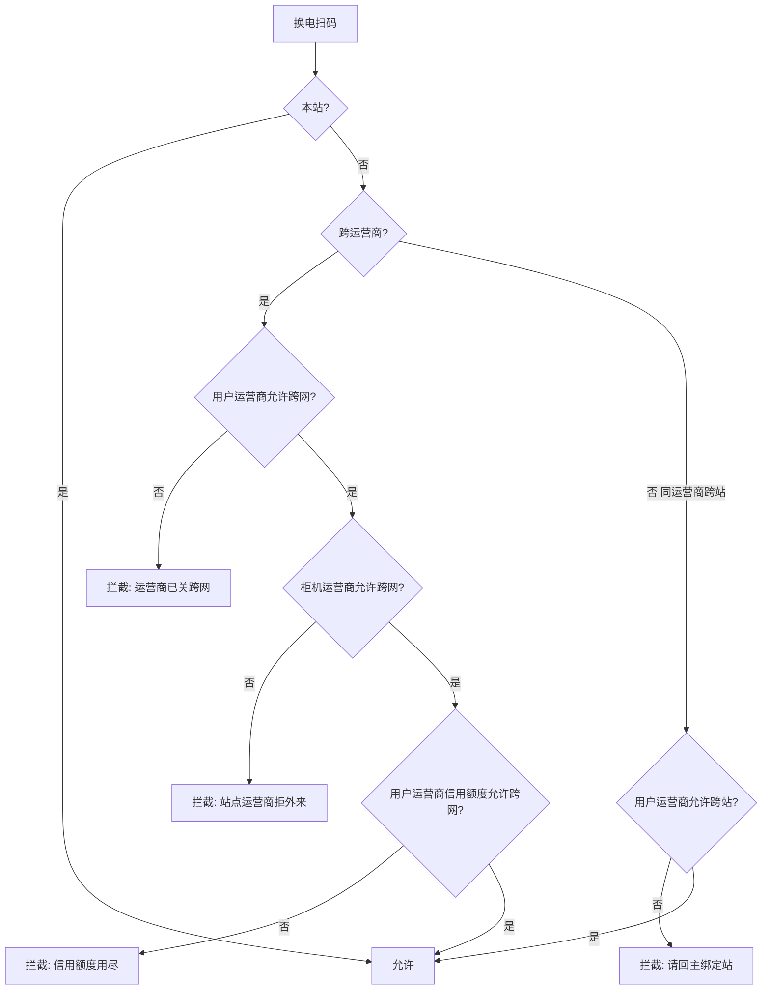

# 换电范围策略（运营商可配置）

> 运营商在后台「站点 → 换电范围设置」自主控制用户可换电范围。  
> 与 [换电场景与运营商结算.md](./换电场景与运营商结算.md) 中**平台信用额度停跨网**规则叠加生效。

## 1. 概念区分

| 术语 | 含义 | 示例 |
|------|------|------|
| **本站换电** | 用户主绑定站点 = 扫码柜机所在站点 | 浦东站用户 @ 浦东柜 |
| **跨站点换电** | 同一运营商，主绑定站点 ≠ 柜机站点 | 浦东站用户 @ 世博柜（均属 OP-SX） |
| **跨网换电** | 用户归属运营商 ≠ 柜机归属运营商 | OP-SX 用户 @ OP-LJZ 柜 |

**主绑定站点**：个人用户为购套餐站点；渠道成员为额度分配/登记站点。

## 2. 运营商开关

| 开关 | 默认 | 关闭后效果 |
|------|------|------------|
| **允许跨网换电** | 开启 | ① 向本运营商付费的用户（个人+渠道）**不可**在其他运营商柜机换电；② 其他运营商用户**不可**在本运营商任意站点换电（**双向封闭**） |
| **允许跨站点换电** | 开启 | 本运营商旗下用户**仅可在主绑定站点**换电，不可前往同运营商其他站点 |

**本站换电始终允许**（不受上述开关影响）。

## 3. 准入校验顺序（换电扫码）

## 4. 与平台管控的关系

| 管控来源 | 触发条件 | 影响范围 |
|----------|----------|----------|
| **运营商自关跨网** | 后台手动关闭 | 双向：出站 + 外来 |
| **运营商自关跨站** | 后台手动关闭 | 同运营商跨主绑定站 |
| **信用额度停跨网** | 保证金=0 且信用额度用尽 | 仅限制该运营商**所属用户出站**跨网；不替代站点运营商的「拒外来」开关 |

## 5. 产品字段（开发）

| 字段 | 说明 |
|------|------|
| `operator_id` | 运营商 |
| `cross_network_enabled` | 是否允许跨网换电（默认 true） |
| `cross_site_enabled` | 是否允许跨站点换电（默认 true） |
| `user_home_site_id` | 用户主绑定站点 |
| `cabinet_site_id` | 扫码柜机站点 |
| `cabinet_operator_id` | 柜机归属运营商 |
| `user_owner_operator_id` | 用户归属运营商（套餐售卖方/额度售卖方） |
| `block_reason` | 拦截原因枚举 |

**block_reason 枚举（建议）**：

- `HOME_SITE_ONLY` — 运营商关闭跨站
- `CROSS_NET_DISABLED_BY_USER_OP` — 用户运营商关闭跨网（出站）
- `CROSS_NET_DISABLED_BY_CABINET_OP` — 柜机运营商关闭跨网（拒外来）
- `CROSS_NET_CREDIT_EXHAUSTED` — 信用额度停跨网
## 6. 验收用例

| # | 用户 | 主绑定站 | 扫码站 | OP-SX 跨网 | OP-SX 跨站 | 预期 |
|---|------|----------|--------|:----------:|:----------:|------|
| 1 | 个人·OP-SX | 浦东 | 浦东 | — | — | 成功 |
| 2 | 个人·OP-SX | 浦东 | 世博 | — | 关 | 失败·请回主绑定站 |
| 3 | 个人·OP-SX | 浦东 | 陆家嘴 | 关 | — | 失败·运营商关跨网 |
| 4 | 个人·OP-LJZ | 陆家嘴 | 浦东 | OP-SX 跨网关 | — | 失败·站点拒外来 |
| 5 | 个人·OP-SX | 浦东 | 滨江 | — | — | 失败·OP-BJ 信用额度用尽（平台） |
| 6 | 渠道·OP-SX | 浦东 | 陆家嘴 | 开 | — | 成功·跨网；U 代付跨网设备费；渠道池 −1 人天 |

## 7. 后台与骑手端

| 端 | 位置 |
|----|------|
| 运营商后台 | 站点 → **换电范围设置**（两个开关） |
| 骑手端 | 扫码换电准入拦截 + Toast/失败页文案 |

## 修订记录

| 版本 | 日期 | 说明 |
|------|------|------|
| 1.0 | 2026-06-10 | 初版：跨网双向封闭、跨站主绑定站限制 |
| 1.1 | 2026-06-11 | 渠道成员允许跨网换电；移除 `CHANNEL_CROSS_CONTRACT` 拦截 |
